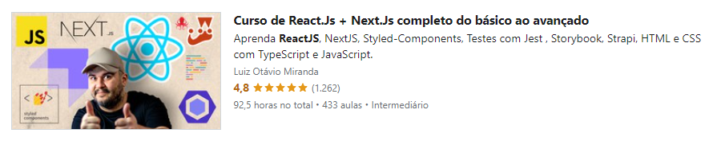

PROGRAMAÇÂO DE ESTUDO: React Básico

- [x] Introdução à seção 

- [x] Ambiente de desenvolvimento no Windows 

- [x] Ambiente de desenvolvimento no Ubuntu 20.04 

- [x] npx create-react-app - parte 1 

- [x] npx create-react-app - parte 2 - [Veja o projeto aqui! 🚀](https://github.com/araujoleonardo310/my-app)

- [x] npm run build - Exemplo

- [x] Discord para alunos

- [x] React não precisa estar na página toda

- [x] Componentes funcionais e componentes de classe

- [x] Componentes de classe com estado (stateful)

- [x] Links para o projeto no Github

- [x] State com arrays e objetos

- [x] Lifecycle methods (métodos de ciclo de vida) - Parte 1

- [x] Lifecycle methods (métodos de ciclo de vida) - Parte 2

- [x] Buscando dados externos com fetch (Data fetching) [Veja o projeto aqui! 🚀](https://github.com/araujoleonardo310/React-data_fetching-)

- [x] Props e organização dos componentes - Parte 1

- [x] Props e organização dos componentes - Parte 2

- [x] Props e organização dos componentes - Parte 3

- [ ] Trabalhando com inputs de texto

- [ ] Fluxo de dados, componentes e state vs props

- [ ] Decidir onde o estado vive é importante (React Developer Tools)

- [ ] Eventos Sintéticos do React (SyntheticEvent)

- [ ] Configurando o GIT e SSH Keys no Windows

- [ ] Configurando o GIT e SSH Keys no Ubuntu

- [ ] Deploy do nosso projeto na Netlify

- [ ] Aviso sobre a próxima aula e React Hooks (não se preocupe se não entender)

- [ ] Migrando para React Hooks

- [ ] Mais sobre this.setState em classes

- [ ] Introdução à testes com o Jest e Testing Library - Parte 1

- [ ] Introdução à testes com o Jest e Testing Library - Parte 2

- [ ] Introdução à testes com o Jest e Testing Library - Parte 3

- [ ] Introdução à testes com o Jest e Testing Library - Parte 3

- [ ] Eslint, prettier, editorconfig e prop-types

- [ ] ERRATA: defaultProps e destructuri

 
 

<h3>Descrição e detalhes do curso</h3>

 

    
    <h4 align=center>Curso de React.Js + Next.Js completo do básico ao avançado (<a href="https://www.udemy.com/share/104bce3@ZT2iO2l5pOcDk0qImOrpAt-Uu1SExCjiN5rpjH5D-c8JofRrrp3YFhKR8y5HYrpm/">Saiba mais! 🚀💻</a>)</h4> 
    
Aprenda React, React Hooks, Componentes funcionais e de classe, Context API, Fetch API e outras partes relacionadas com o ReactJS

Aprenda NextJS e suas nuances: SSG, SSR, ISR, CSR e mais...

Aprenda a configurar e criar testes com Jest, Testing Library, Mock Service Worker e outras ferramentas.

Aprenda a usar o Strapi + GraphQL Queries e Mutations para criar e consumir APIs

Aprenda a configurar e usar o Storybook

Aprenda a usar o Styled-Components de forma avançada
Aprenda HTML e CSS nas últimas versões (HTML5 e CSS3)

Aprenda o essencial do JavaScript ES6+

Aprenda o essencial do TypeScript

Aprenda Autenticação de usuários com Strapi, Next Js e NextAuth Js (Sessions e JWT Token com cookies httpOnly)

Aprenda a criar Single Page Applications (SPAs) e páginas com Server Side Rendering (SSR) usando React e Next.

Comandos de terminal Unix (Extra)

